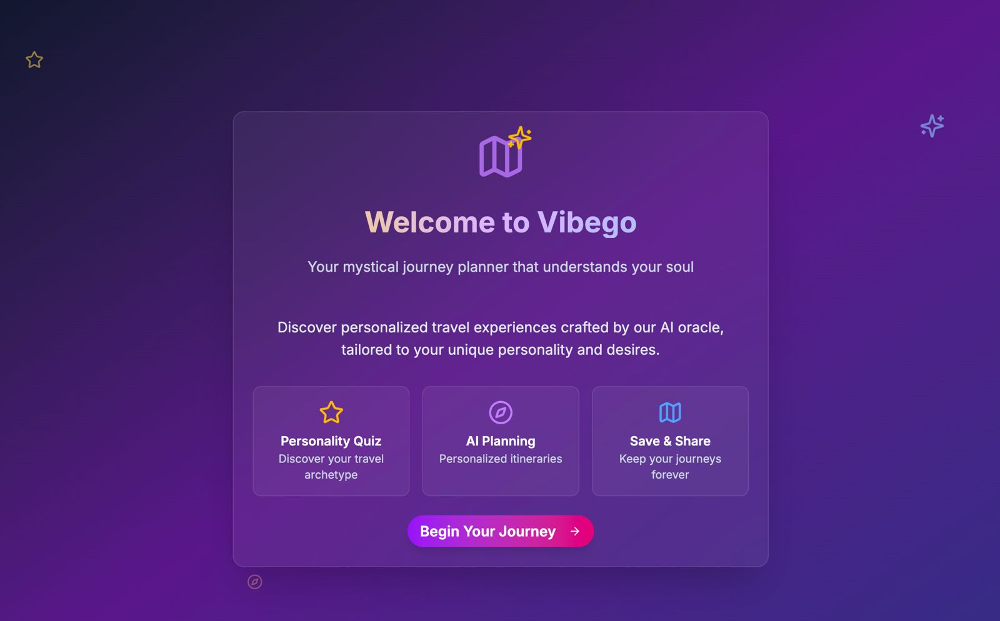
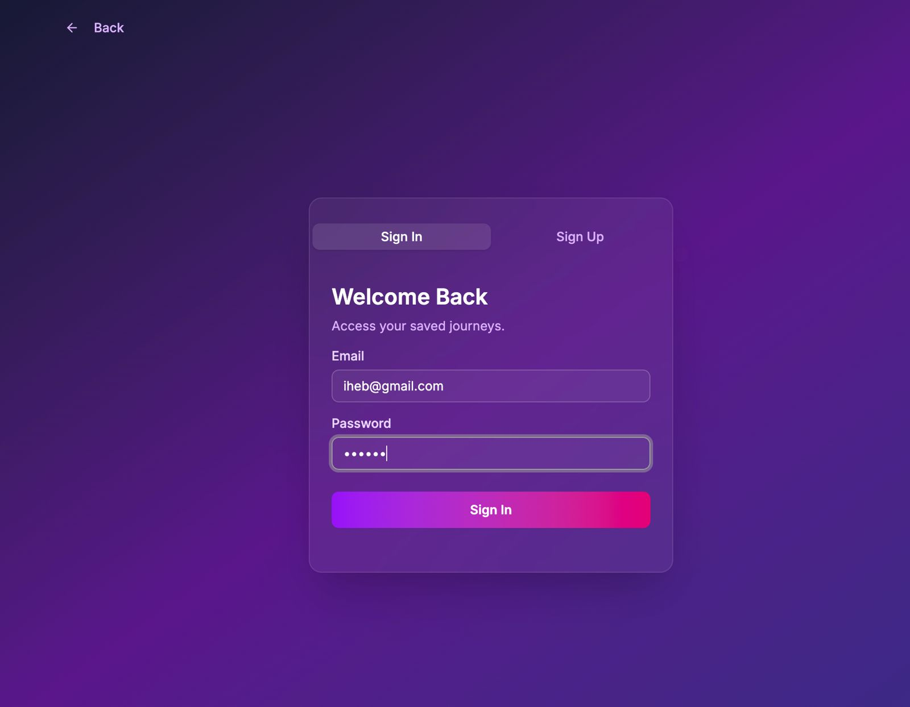
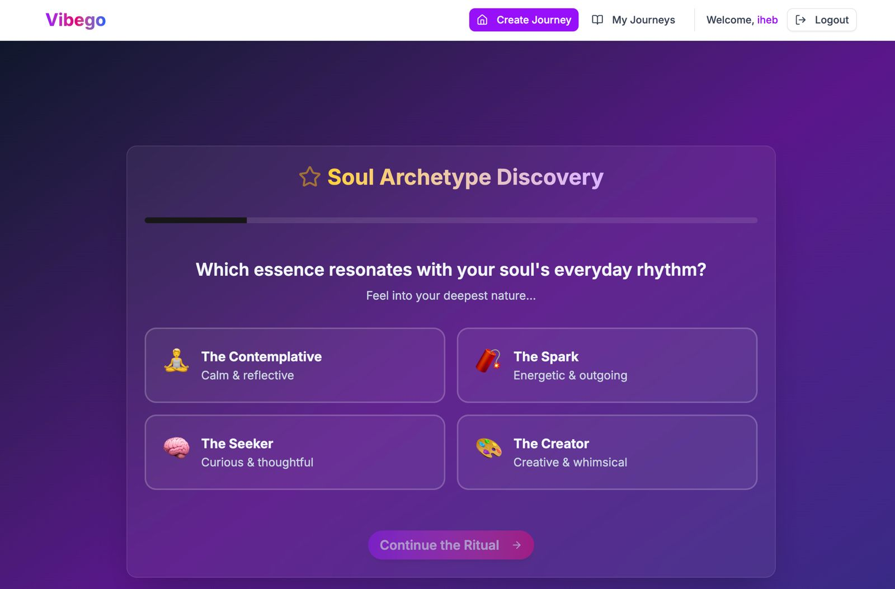
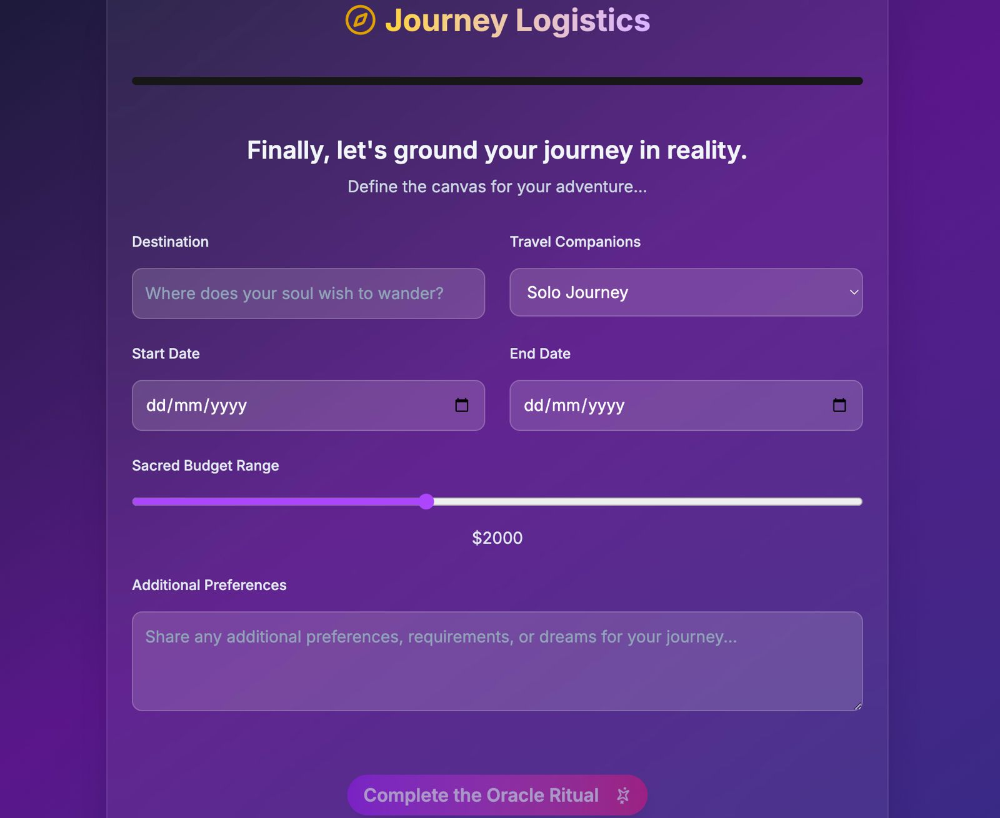
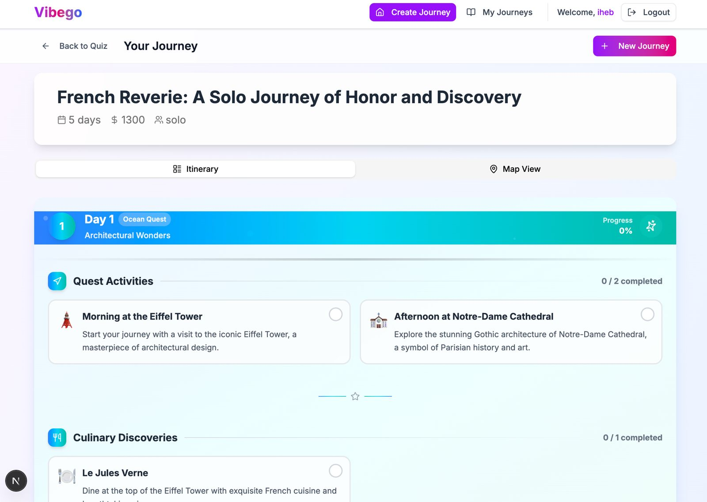
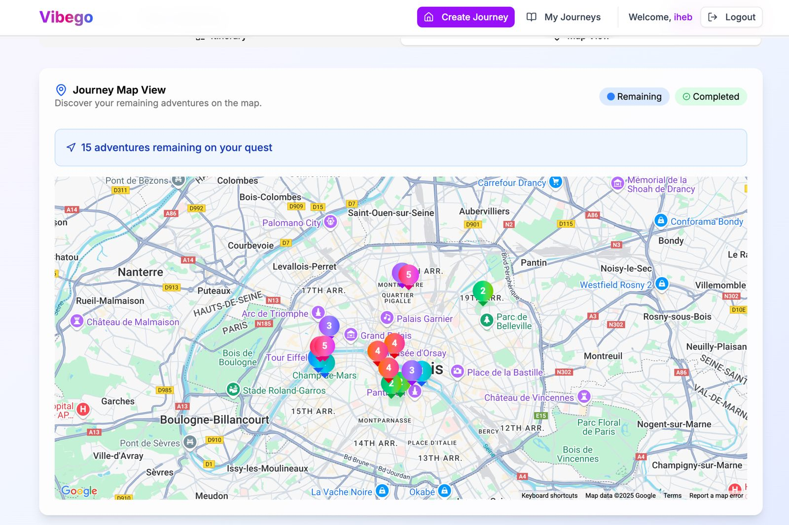
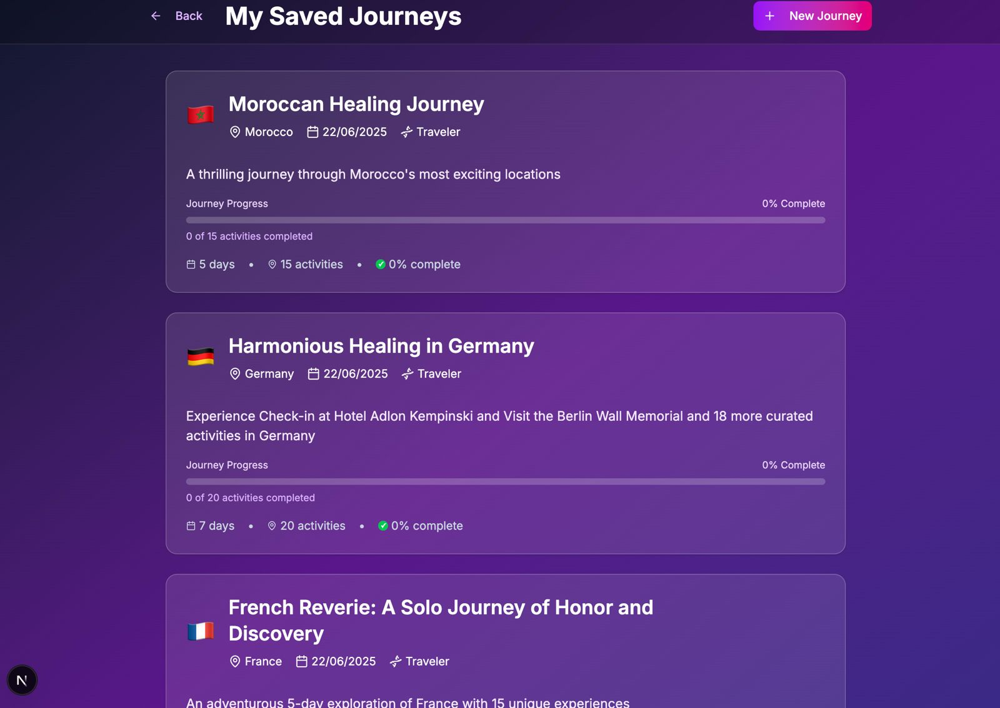

# Vibego - Your Mystical AI Travel Planner ✨

[](https://nextjs.org/) [](https://firebase.google.com/) [](https://openai.com/) [](https://tailwindcss.com/)

**Vibego transforms tedious travel planning into an enchanting quest of self-discovery. By reading your soul through a mystical quiz, our AI crafts a deeply personalized journey that resonates with your unique traveler archetype.**

---

## 📋 Project Summary

**Vibego** is a revolutionary AI-powered travel planning application that combines personality psychology with advanced AI to create deeply personalized travel experiences. Unlike traditional travel apps that focus on generic recommendations, Vibego uses a mystical "Pre-Departure Oracle" quiz to determine your unique traveler archetype and generates itineraries that align with your core motivations and desires.

### What Makes Vibego Special:
- **Personality-Driven AI:** Our quiz determines your traveler archetype (Explorer, Seeker, Foodie, etc.) and the AI uses this to craft personalized experiences
- **Gamified Experience:** Complete activities like a quest with real-time progress tracking and visual feedback
- **Smart Map Integration:** Interactive maps that only show remaining activities, updating as you progress
- **Mystical UI/UX:** Beautiful, animated interface with 7 unique color themes that make travel planning magical
- **Persistent Progress:** Firebase integration ensures your journey progress is saved and synced across sessions

## 🚀 Project Demo

- **GitHub Repository:** [This Repository - Made Public for Judging Period (12:00-3:00pm Sunday)]
- **Video Walkthrough:** `[3-Minute Demo Video Link Here]`

## 🖼️ Demo Images & App Showcase

### Core User Journey
| Landing Page | Sign In | Oracle Quiz |
| :-------------: | :-------------: | :-------------: |
|  |  |  |

### Travel Planning Experience
| Logistics Setup | Generated Itinerary | Map Integration |
| :-------------: | :-------------: | :-------------: |
|  |  |  |

### Saved Journeys
| Saved Journeys List |
| :-------------: |
|  |

## 🔮 The Concept: From Chore to Quest

Traditional travel planning is a chore. You answer boring questions about budgets and dates, and you get a generic, uninspired list of tourist traps.

**Vibego flips the script.** We believe a journey should be an extension of your personality. Our core innovation is the **"Pre-Departure Oracle,"** a personality quiz that uncovers your unique **traveler archetype**.

- Are you an **Explorer** 🗺️, craving adventure off the beaten path?
- A **Seeker** 🧘, on a quest for spiritual tranquility?
- A **Foodie** 🍝, chasing the ultimate culinary experiences?

Based on your soul's profile, our AI doesn't just build a trip—it crafts a **quest**. Each itinerary is a narrative, a story waiting for you to live it, with every detail tailored to what truly inspires you.

## 📖 Project Overview

### The Problem We Solve
Traditional travel planning apps treat all users the same, offering generic recommendations based on basic filters like price and location. This results in uninspiring, cookie-cutter itineraries that don't resonate with individual personalities or travel motivations.

### Our Solution
Vibego introduces a **personality-first approach** to travel planning:

1. **Soul Profiling:** Users complete our "Pre-Departure Oracle" quiz that analyzes their travel personality across multiple dimensions
2. **AI Personalization:** Our OpenAI-powered engine uses this psychological profile to generate deeply customized itineraries
3. **Gamified Experience:** Travel becomes a quest with completion tracking, progress bars, and visual feedback
4. **Persistent Progress:** Firebase ensures users can track their journey progress across sessions
5. **Smart Assistance:** Intelligent map integration that adapts to show only remaining activities

### Target Audience
- **Millennial & Gen-Z Travelers** who value personalized, Instagram-worthy experiences
- **Solo Travelers** seeking adventures that align with their personality
- **Experience Seekers** who prefer curated activities over generic tourist attractions
- **Digital Nomads** who want efficient, personalized planning tools

### Innovation & Differentiation
- **First-of-its-kind personality quiz** for travel planning
- **Mystical, gamified UI** that makes planning enjoyable rather than tedious
- **Real-time progress tracking** with visual completion feedback
- **Smart map filtering** that updates based on user progress
- **Seven unique mystical themes** that create an enchanting user experience

## 🌟 Key Features

### 🧠 AI-Powered Itinerary Generation
- **Deep Personalization:** Leverages OpenAI's GPT-4 to create itineraries that go beyond simple preferences, aligning with the user's core motivations and personality archetype.
- **Rich Content:** Generates activities, restaurants, daily themes, and even an inspirational "soul quote" for the trip.
- **Dynamic & Smart:** Understands context like destination, trip length, companions, and budget to create a cohesive and practical plan.

### 🎨 Mystical & Animated UI/UX
- **Enchanting Themes:** Features 7 unique, mystically-inspired color schemes (e.g., *Ocean Quest*, *Forest Adventure*) that dynamically change for each day of the itinerary.
- **Subtle Animations:** The entire interface is alive with smooth, purposeful animations—from floating particles and spinning icons to interactive hover effects that make the UI feel magical and engaging.
- **Glassmorphism & Gradients:** Uses modern design principles like backdrop blur and animated gradients to create a beautiful, polished, and premium feel.

### ✅ Interactive Quest Log (Itinerary)
- **Gamified Completion:** Users can click to "complete" activities and restaurants, instantly updating the UI.
- **Visual Feedback:** Completed items are visually distinguished with a strikethrough, a green glow, and an animated checkmark, providing satisfying feedback.
- **Progress Tracking:** Each day card and the journey as a whole displays a real-time completion percentage, turning the trip into a fun, trackable quest.

### 🗺️ Smart Journey Map
- **Intelligent Filtering:** The integrated Google Map view is smart—it only shows pins for **remaining (uncompleted)** activities. As you check items off your list, they vanish from the map, keeping you focused on your next adventure.
- **Custom Markers & Info Windows:** Displays beautiful, custom map markers themed with the day's color scheme, and provides activity details on hover.

### 💾 Persistent State & Saved Journeys
- **Real-Time Persistence:** Utilizes Firebase Firestore to ensure that every completed task is saved to the database instantly. Users can close the app and return later to find their progress exactly as they left it.
- **Progress at a Glance:** The "My Journeys" list elegantly displays each saved trip with a visual progress bar and completion percentage, making it easy to see how far along they are on each quest.
- **Seamless Experience:** Saved journeys load instantly without AI calls, providing a fast and fluid user experience.

## 💻 Tech Stack

- **Framework:** [Next.js 15](https://nextjs.org/) (App Router)
- **Styling:** [Tailwind CSS](https://tailwindcss.com/)
- **UI Components:** [shadcn/ui](https://ui.shadcn.com/) & [Lucide React](https://lucide.dev/) for icons.
- **Authentication:** [Firebase Authentication](https://firebase.google.com/docs/auth)
- **Database:** [Firebase Firestore](https://firebase.google.com/docs/firestore) for real-time data persistence.
- **AI Engine:** [OpenAI API](https://openai.com/blog/openai-api) (GPT-4)
- **Mapping:** [Google Maps Platform](https://developers.google.com/maps) (React Integration)
- **Development:** Modern development stack with TypeScript, ESLint, and hot reloading

## 📂 Project Structure

The project follows the standard Next.js App Router structure, promoting a clean and scalable architecture.

```
/
├── app/
│   ├── api/                # API routes (e.g., /api/generate-itinerary)
│   ├── components/         # Reusable React components (UI, layout, etc.)
│   │   ├── ui/             # shadcn/ui components
│   │   └── itinerary-display.tsx # Core component for showing journeys
│   ├── context/            # Global state (AuthContext)
│   ├── journeys/           # Pages for viewing saved journeys
│   │   ├── page.tsx        # List of all saved journeys
│   │   └── [id]/page.tsx   # View a specific saved journey
│   ├── layout.tsx          # Root layout
│   └── page.tsx            # The main landing/quiz page
├── lib/                    # Helper functions, constants, Firebase config
└── public/                 # Static assets (images, icons, etc.)
    └── screenshots/        # <-- Add your demo screenshots here!
```

## 🛠️ Getting Started

To run this project locally, follow these steps:

### 1. Clone the Repository

```bash
git clone https://github.com/your-username/vibego.git
cd vibego
```

### 2. Install Dependencies

```bash
npm install
```

### 3. Set Up Environment Variables

Create a `.env.local` file in the root of the project and add the following keys. You'll need to get these from your Firebase and OpenAI accounts.

```env
# OpenAI API Key
NEXT_PUBLIC_OPENAI_API_KEY="sk-..."

# Google Maps API Key
NEXT_PUBLIC_GOOGLE_MAPS_API_KEY="AIza..."

# Firebase Configuration
NEXT_PUBLIC_FIREBASE_API_KEY="..."
NEXT_PUBLIC_FIREBASE_AUTH_DOMAIN="..."
NEXT_PUBLIC_FIREBASE_PROJECT_ID="..."
NEXT_PUBLIC_FIREBASE_STORAGE_BUCKET="..."
NEXT_PUBLIC_FIREBASE_MESSAGING_SENDER_ID="..."
NEXT_PUBLIC_FIREBASE_APP_ID="..."
```

### 4. Run the Development Server

```bash
npm run dev
```

Open [http://localhost:3000](http://localhost:3000) in your browser to see the application running.

## 🏆 Hackathon Development

This project was developed for a hackathon with the following approach:

### Development Timeline
- **Planning & Design:** Concept ideation, UI/UX design, and technical architecture
- **Core Features:** Authentication, personality quiz, AI integration, and itinerary display
- **Enhanced UX:** Mystical themes, animations, completion tracking, and map integration
- **Data Persistence:** Firebase integration for saved journeys and progress tracking
- **Polish & Testing:** Bug fixes, responsive design, and user experience refinements

### Technical Challenges Solved
1. **AI Prompt Engineering:** Crafted detailed prompts to generate rich, personalized itineraries
2. **Real-time State Management:** Implemented seamless completion tracking with Firebase
3. **Map Integration:** Built smart filtering system that updates based on user progress
4. **Responsive Design:** Created mystical UI that works beautifully across all devices
5. **Performance Optimization:** Ensured fast loading for both new and saved journeys

### Key Achievements
- ✅ **Full-stack application** with modern tech stack
- ✅ **AI-powered personalization** using OpenAI GPT-4
- ✅ **Real-time data persistence** with Firebase
- ✅ **Interactive map integration** with Google Maps
- ✅ **Responsive, animated UI** with mystical themes
- ✅ **Complete user journey** from quiz to saved progress tracking

## 📱 Features Demonstrated

### Core Functionality
- [x] User authentication and profile management
- [x] Personality quiz with traveler archetype detection
- [x] AI-powered itinerary generation
- [x] Interactive completion tracking
- [x] Smart map integration with filtered pins
- [x] Saved journeys with progress persistence
- [x] Responsive design for all devices

### Advanced Features
- [x] Seven mystical color themes with animations
- [x] Real-time progress bars and completion percentages
- [x] Gamified quest-like experience
- [x] Toast notifications for user feedback
- [x] Grid layout for better content organization
- [x] Persistent state across browser sessions

## Learn More

To learn more about Next.js, take a look at the following resources:

- [Next.js Documentation](https://nextjs.org/docs) - learn about Next.js features and API.
- [Learn Next.js](https://nextjs.org/learn) - an interactive Next.js tutorial.

You can check out [the Next.js GitHub repository](https://github.com/vercel/next.js) - your feedback and contributions are welcome!

## Deploy on Vercel

The easiest way to deploy your Next.js app is to use the [Vercel Platform](https://vercel.com/new?utm_medium=default-template&filter=next.js&utm_source=create-next-app&utm_campaign=create-next-app-readme) from the creators of Next.js.

Check out our [Next.js deployment documentation](https://nextjs.org/docs/app/building-your-application/deploying) for more details.
